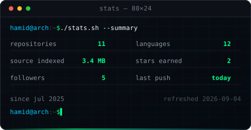

<div align="center">



<p>
  
  
  <a href="https://t.me/Daashamid"></a>
  <a href="https://x.com/Daashamid82"></a>
</p>

I write Python that removes small daily annoyances on Linux — captive portals, keyboard
backlights, repetitive clicks. Python is the one language I'd call solid; Linux, Git, C
and the web bits are still homework.

**Where I want to end up: networking and security. I'm not there yet, and this page
doesn't pretend otherwise.**

</div>

<br/>

## ▍`$ whoami`

<table>
<tr>
<td width="57%" valign="top">

```python
class Hamid:
    """Python dev. The rest is homework."""

    username = "Daashamid"
    location = "Neyshabour, Iran"
    telegram = "@Daashamid"

    solid    = ["Python"]
    learning = ["Linux", "Git", "C", "C++"]
    web      = ["HTML", "CSS"]
    studying = ["Network+"]
    curious  = ["Security", "IoT"]   # someday
    not_mine = ["Rust", "Kotlin", "Dart"]
    # ^ AI wrote those repos. I can read
    #   them, I can't claim them.

    def daily(self) -> None:
        while alive:
            read_docs(); write_python()
            break_it(); fix_it()
```

- 🔭 Building **Linux automation and Telegram bots in Python**
- 🧰 At home in a terminal — and slow at everything that isn't Python
- 📡 Studying **Network+**: TCP/IP, subnetting, DNS
- ⚡ I learn by breaking things, then reading why they broke

</td>
<td width="43%" valign="top">



<div align="center">


</div>

</td>
</tr>
</table>

## ▍`$ ls ~/arsenal`

<div align="center">

**What I actually reach for**<br/>


**Can read and change, not yet fluent**<br/>


**Repos of mine use these — because AI wrote them, not me**<br/>


</div>

## ▍`$ git log --oneline ~/projects`

<table>
<tr>
<td width="50%" valign="top">

### [📶 auto-wifi-biruni](https://github.com/Daashamid/auto-wifi-biruni)

Signs into the University of Birjand captive-portal Wi-Fi by itself, from boot. Selenium drives Firefox through the login page so I never see it again.

`Python` · `Selenium` · `GeckoDriver` · `startup`

<a href="https://github.com/Daashamid/auto-wifi-biruni">
  
  
</a>

</td>
<td width="50%" valign="top">

### [⌨️ backlight-keyboard](https://github.com/Daashamid/backlight-keyboard)

Keyboard-backlight controller for Linux. Listens to the Insert key through `evdev` and cycles modes — no desktop environment required.

`Python` · `evdev` · `Bash`

<a href="https://github.com/Daashamid/backlight-keyboard">
  
  
</a>

</td>
</tr>
</table>

## ▍`$ cat ~/lab/wip.md`

> Private while I finish them. Each one goes public as it stops embarrassing me.

| Project | Stack | Status | What it is |
|---|---|---|---|
| `AI-Crypto` | Python | 🚧 WIP | Crypto experiments driven by AI ideas |
| `Desktop-Remoter` | Python | 🚧 WIP | Remote desktop automation playground |
| `auto-confirm-bot` | Python | 🚧 WIP | Telegram bot that handles confirmations for me |
| `Bime-Bot` | Python | 🚧 WIP | Telegram bot, still finding its shape |
| `sms-Bomber` | Python | 🔬 Research | SMS API sandbox — rate limits, throttling, abuse handling |
| `Forex-bot` | MQL5 | 🧪 Experiment | Trading-bot experiment, not a language I know |
| `CDE` | Rust | 🤖 AI-written | Download engine. I can read it, I didn't write it |
| `V2DayNg` | Kotlin | 🤖 AI-written | Android client. Same story |

## ▍`$ ./progress.sh`

<div align="center">



</div>

### `$ cat ~/roadmap.md`

Every box below is a real checkbox in this file. The day I can do one without a tutorial
open, `[ ]` becomes `[x]` and it ticks. GitHub renders them read-only, so nobody can tick
them on my behalf — including me, without a commit. Click a heading to open it.

<details open>
<summary><b>🐍 Python</b> — the one I'd put on a CV</summary>

- [x] syntax, functions, classes
- [x] files, JSON, `requests`
- [x] Selenium automation that survives a reboot
- [x] Telegram bots
- [x] `evdev` — talking to Linux input devices
- [ ] `asyncio` without copy-pasting
- [ ] tests I actually trust
- [ ] packaging, and one thing published to PyPI

</details>

<details>
<summary><b>🐧 Linux</b> — daily driver, still learning the plumbing</summary>

- [x] terminal over GUI, permissions, paths
- [x] getting my own scripts to run at boot
- [ ] writing a `systemd` unit from memory
- [ ] shell scripting without a second tab open
- [ ] reading `journalctl` when something breaks

</details>

<details>
<summary><b>🌿 Git + GitHub</b> — daily tool, shallow knowledge</summary>

- [x] clone, branch, commit, push
- [x] remotes, SSH keys, pull requests
- [ ] rebase and conflict surgery without fear
- [ ] an Actions workflow I wrote myself

</details>

<details>
<summary><b>📡 Networking — Network+</b> — the current homework</summary>

- [x] OSI model, TCP vs UDP
- [ ] subnetting until it's boring
- [ ] DNS, DHCP and NAT end to end
- [ ] Wireshark on my own traffic
- [ ] pass the exam

</details>

<details>
<summary><b>⚙️ C / C++</b> — university level, honestly</summary>

- [x] pointers, arrays, structs
- [ ] memory management without leaks
- [ ] one project I actually finished in C

</details>

<details>
<summary><b>🌐 HTML / CSS</b> — enough to put a page together</summary>

- [x] semantic layout
- [ ] responsive without guessing
- [ ] one real site, start to finish

</details>

<details>
<summary><b>🔭 Not started — just interested</b></summary>

- [ ] security fundamentals (TryHackMe Pre-Security)
- [ ] Nmap and Burp basics, on machines I own
- [ ] IoT past the one university course
- [ ] Rust or Kotlin for real, typed by hand

</details>

## ▍`$ git stats --all`

<div align="center">




</div>

## ▍`$ ./snake.sh`

> Quiet grid — the account is barely a year old, and it fills in as I go.

<div align="center">

<picture>
  <source media="(prefers-color-scheme: dark)" srcset="https://raw.githubusercontent.com/Daashamid/Daashamid/output/github-contribution-grid-snake-dark.svg" />
  <source media="(prefers-color-scheme: light)" srcset="https://raw.githubusercontent.com/Daashamid/Daashamid/output/github-contribution-grid-snake.svg" />
  
</picture>

</div>

## ▍`$ contact --help`

<div align="center">

<a href="https://t.me/Daashamid">
  
</a>
<a href="https://x.com/Daashamid82">
  
</a>
<a href="https://github.com/Daashamid">
  
</a>

<br/>

<i>“First, solve the problem. Then, write the code.”</i>

<br/>


</div>


